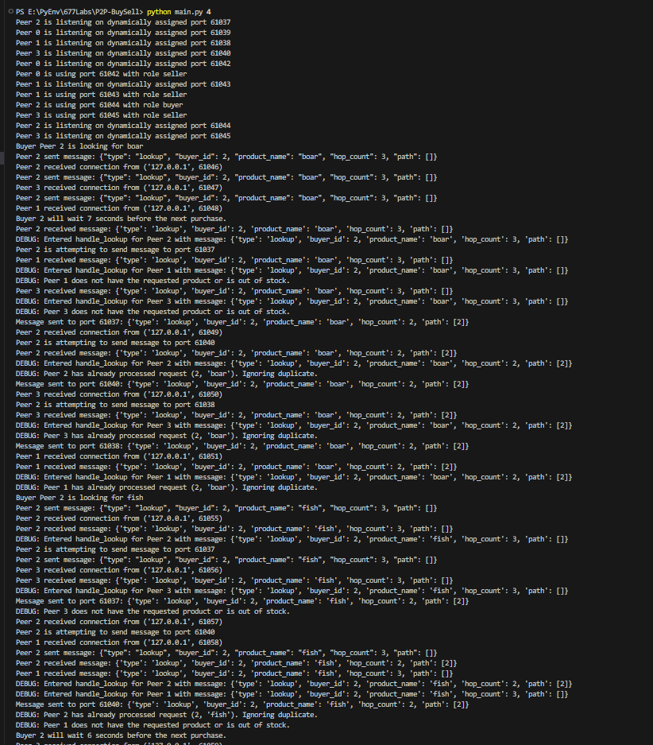

# Bazaar-Style Peer-to-Peer (P2P) Marketplace

### Lab 1 (COMPSCI 677 - Fall 2024)

## Project Overview: Bazaar-Style Peer-to-Peer (P2P) Marketplace

This project implements a decentralized, peer-to-peer marketplace modeled after a bazaar. Participants in the marketplace can act as buyers or sellers, trading goods in an unstructured P2P network. The marketplace uses a multi-threaded architecture where participants communicate using sockets. The goal of this project is to simulate the interactions in the bazaar, including trading goods, switching roles, and handling multiple concurrent requests efficiently.

How to run this project:

```
python main.py <N Peers>
```

N Peers: This refers to the number of participants or nodes in the P2P network. ( N ) represents the total number of peers (participants) in the system, such as buyers and sellers. It’s passed as a command-line argument or specified beforehand, and each peer can be a buyer or a seller.

**Example:**

```
python main.py 6
```

### Expected Output


